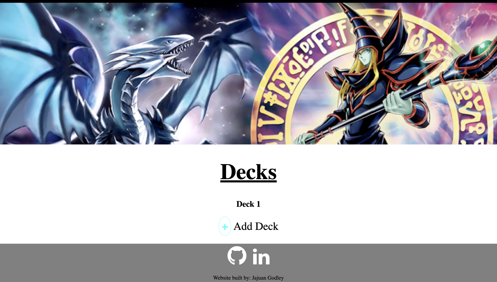
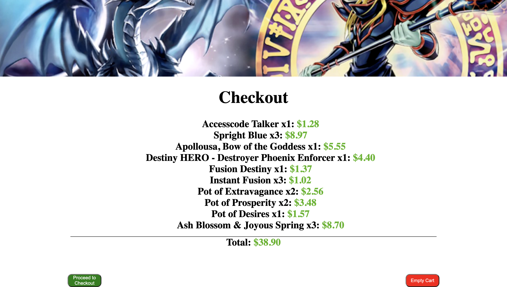

# Project 2 - Yugioh Store Frontend  

# Visit Website  
https://ygo-store.netlify.app/

# Project Description  
A fake online card store with a deck making feature

# Technology Used  
-HTML  
-CSS  
-Javascript

# Landing Page  
  
Upon loading the page 20 random cards will be displayed.  
Where you will be able to search for cards, look a card's stats by clicking the info button, or adding the card to your cart or deck.  

# Searching for Cards  
  
You can search for cards by typing text in the search bar and clicking the search button or pressing the enter button. Cards will be displayed on the page depending on the archetype they belong to, their name, or if the text you typed is contained in the card's name.  

# Info Page  
  
Clicking on a card's info button will take you to their info page.  
Where you can see their Name, Type, Effect, etc.  

# Deck Making  

By clicking the checkbox at the top of the homepage or pressing the D key, you will toggle between Deck mode and Cart mode. While in Deck mode the "Add to Cart" button will be replaced with the "Add to Deck" button.  
By clicking the "Show Deck" button at the top of the page you can see the cards you've added so far, and by clicking the "Empty Deck" button you'll delete all the cards in your main and extra deck.  

After finishing making your deck, you can save your deck to the database by clicking "Deck Maker" at the top of the page.  
While there you can click the "+" at the bottom of the page, give your deck a name and the deck you've made will be saved to the database.  
To see your deck click on the name you gave it and the page will display all the cards you added to your deck.  

**Deck Making Rules:**  
-Token and Skill cards cannot be added to your deck  
-Only a maximum of 60 cards can be added to your main deck  
-Only a maximum of 15 cards can be added to your extra deck  

# Checkout  
  
After adding cards to your cart, you can go to the checkout page by clicking the shopping cart icon.  
The checkout page shows you the cards you added, how many you added along with their price, and the total price of the cards added.  
The "Proceed to checkout" button does nothing, and the "Empty Cart" button clears the cart database.